# 160CrackMe之092 Blowfish算法分析

> [反汇编练习 160个CrackME](https://www.52pojie.cn/thread-709699-1-1.html)

### 工具与环境：

* 吾爱破解 xp虚拟机
* 吾爱破解 OllyDbg
* IDA Pro
* Exeinfo PE
* RL!deUPX 1.x - 2.x unpacker by ap0x

### 初体验：

* 首先运行程序，看到如下界面

  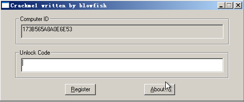

* Computer ID框已经有内容，而且是锁死的不能编辑，随便输入Unlock Code然后按Register

  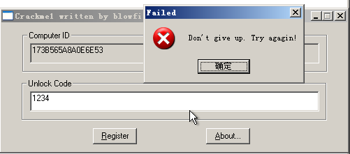

* 基本知道该程序想要我们输入的Unlock Code会和电脑的某些信息有关（Computer ID嘛）
* 同时对于这里出现的弹窗，我们待会儿可以尝试使用bp MessageBoxA或者是搜索字符串，看能不能断下来

### 开始吧

* 首先用Exeinfo PE看下

  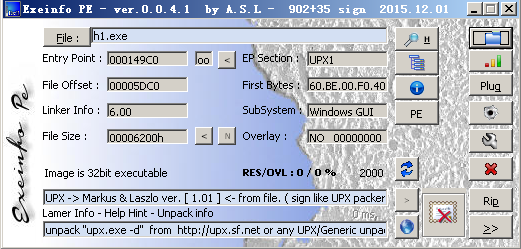

* UPX壳，使用工具脱壳

  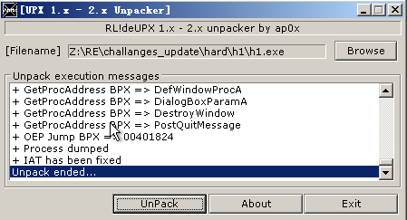

* 脱壳主要是为了方便使用IDA静态分析，对于使用OllyDbg其实没什么影响，很容易找到OEP

  1. 首先第一句就看到pushad

     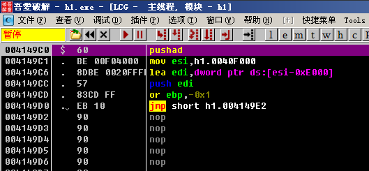

  2. 执行后，Dump窗口进入栈顶地址(0012FFA4)，在该处设置硬件断点

     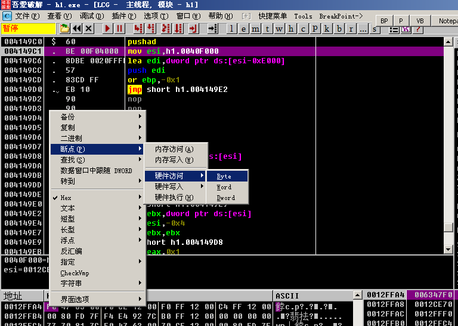

  3. 按F9继续执行，看到在popad后停下了

     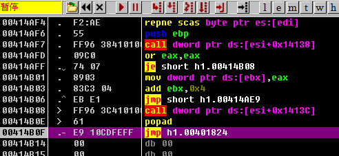

  4. 是一句jmp，jmp到的正是我们要的OEP

     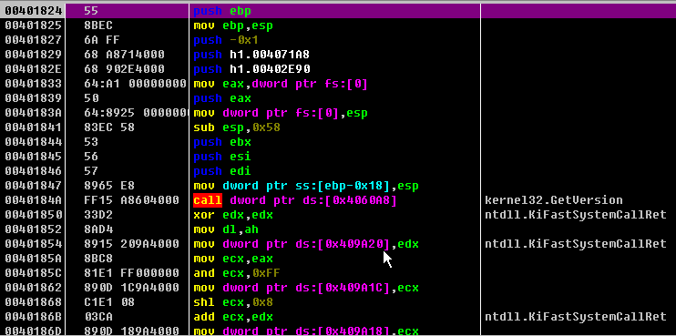

* 后面的过程基本就是对blowfish cipher是怎么被使用的分析了，强烈建议分析前了解一下blowfish的加密过程，我是看的维基百科这个：[Blowfish (cipher)](https://en.wikipedia.org/wiki/Blowfish_(cipher))，有伪代码而且文字不多，我大概简述一下我的理解

  * Blowfish是个block cipher，块大小block size是64-bit

  * 使用它时，首先会使用用户提供的秘钥串更新（生成）一系列的字节，分为两组，称为S-boxes和P-boxes（S盒和P盒），也就是相当于真正加密解密的时候我们只关注S盒和P盒的内容（S-boxes和P-boxes依赖于用户秘钥）

  * 首先看图理解一下加密过程，16层的Feistel网络

    

  * 先贴一下维基百科的伪代码

    ```c++
    uint32_t P[18]; // P盒，共4*18=72 bits
    uint32_t S[4][256]; // S盒，共4*4*256=4096 bits
    
    // Feistel Network中每层使用的f函数
    uint32_t f (uint32_t x) {
       uint32_t h = S[0][x >> 24] + S[1][x >> 16 & 0xff];
       return ( h ^ S[2][x >> 8 & 0xff] ) + S[3][x & 0xff];
    }
    
    // 加密
    void encrypt (uint32_t & L, uint32_t & R) {
       for (int i=0 ; i<16 ; i += 2) {
          L ^= P[i];
          R ^= f(L);
          R ^= P[i+1];
          L ^= f(R);
       }
       L ^= P[16];
       R ^= P[17];
       swap (L, R);
    }
    
    // 解密
    void decrypt (uint32_t & L, uint32_t & R) {
       for (int i=16 ; i > 0 ; i -= 2) {
          L ^= P[i+1];
          R ^= f(L);
          R ^= P[i];
          L ^= f(R);
       }
       L ^= P[1];
       R ^= P[0];
       swap (L, R);
    }
    
      // ...
      // initializing the P-array and S-boxes with values derived from pi; omitted in the example
      // ...
    // boxes的更新过程
    {
       for (int i=0 ; i<18 ; ++i)
          P[i] ^= key[i % keylen];
       uint32_t L = 0, R = 0;
       for (int i=0 ; i<18 ; i+=2) {
          encrypt (L, R);
          P[i] = L; P[i+1] = R;
       }
       for (int i=0 ; i<4 ; ++i)
          for (int j=0 ; j<256; j+=2) {
             encrypt (L, R);
             S[i][j] = L; S[i][j+1] = R;
          }
    }
    ```

  * 结合图，结合维基百科的伪代码，理解S-boxes和P-boxes的生成，加解密过程

    1. S盒、P盒的生成
       * 可以看到上面伪代码P盒和S盒的定义：一共4168 bits
       * 继续之前，先看下面的加密过程，因为盒子的更新使用了加密过程
       * 首先是P盒、S盒初始化，都是固定的，我后面分析知道都是直接复制内存的内容，维基百科说的复制的内容是通过**pi的十六进制形式**，在写自动求解程序的时候用到的[Blowfish C++代码](https://github.com/h2so5/Blowfish)也是直接把这个写死在程序里
       * 然后分三步（三个for循环），第一步将用户秘钥和盒子异或（用户不要不够长就循环开始异或）
       * 第二步用现有的P盒S盒加密一个块儿（程序中块儿都是64位，用两个32位整型表示L，R，块儿初识全为0），将得到的块复制给两个P盒，也就是这里一共18个P盒，加密9次
       * 第三步用现有的P盒S盒加密这个块儿，将得到的块儿复制给两个S盒，一共1024个S盒，加密512次
    2. 加密过程
       * 可以结合图很好理解，首先是16层的feistel网络，然后是一次异或
       * 其中feistel网络的每一层使用了4个S盒：调用的f函数中使用，具体过程不需要记得，有个印象就行
       * P盒一共18个：16个每层feistel network使用，2个最后的异或使用
    3. 解密过程
       * 可以看到伪代码，和加密过程基本相同
       * 基本只是把P盒反过来用罢了

* 在理解了加密算法之后，分析起来就轻松许多了

  * OD中输入命令

    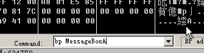

  * F9运行程序，随便输入Unlock Code，按Register，程序停下来了，此时栈中

    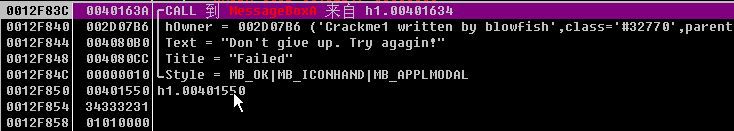

  * 根据返回值找到处理用户输入的代码部分，可以大致看下汇编内容，这里就别折腾汇编了，直接用IDA看下C代码不好吗

  * 根据地址可以找到相应代码部分，按F5看C代码

    ```c++
    BOOL __stdcall DialogFunc(HWND hDlg, UINT a2, WPARAM a3, LPARAM a4)
    {
      HWND v4; // esi@7
      BOOL result; // eax@10
      HWND v6; // esi@13
      HWND v7; // eax@13
      int v8; // eax@13
      CHAR String; // [sp+4h] [bp-40h]@7
    
      if ( a2 == 16 )
      {
        EndDialog(hDlg, 0);
        return 0;
      }
      if ( a2 == 272 )
      {
        sub_401070((int)dword_408980, &dword_4099F0, &dword_4099EC);// 84 66 3E C7    A4 45 F0 D7
        v6 = hDlg;
        SetDlgItemTextA(hDlg, 1002, byte_4099C8);   // Machine Code
        SetDlgItemTextA(v6, 1003, dword_4099F8);    // 00 00 00 00 ?
        v7 = GetDlgItem(v6, 1003);
        SetFocus(v7);
        v8 = lstrlenA("CrackingForFun");
        sub_401130((int)dword_408980, (int)"CrackingForFun", v8);
        return 0;
      }
      if ( a2 != 273 || (unsigned __int16)a3 == 1002 )
        return 0;
      if ( (unsigned __int16)a3 == 1006 )
      {
        DialogBoxParamA(0, (LPCSTR)0x67, hDlg, sub_401700, 0);
        return 0;
      }
      if ( (unsigned __int16)a3 != 1016 )
        return 0;
      v4 = hDlg;
      if ( !GetDlgItemTextA(hDlg, 1003, &String, 64) )
        return 0;
      sscanf(&String, "%08lX%08lX", &hDlg, &a2);
      sub_4010D0((int)dword_408980, (int *)&hDlg, (int *)&a2);
      if ( hDlg || a2 )
      {
        MessageBeep(0x30u);
        MessageBoxA(v4, "Don't give up. Try agagin!", "Failed", 0x10u);
        result = 0;
      }
      else
      {
        MessageBoxA(v4, "You have done a good job.", "Success", 0x30u);
        result = 0;
      }
      return result;
    }
    ```

    注意`sscanf(&String, "%08lX%08lX", &hDlg, &a2);`是从String字符串中读取两个8位的十六进制数(也就是4*8=32 bits)保存到两个整数hDlg和a2中

    这句的上面又调用GetDlgItemTextA，基本可以知道我们输入的Unlock Code是两个十六进制数了

    接着调用了sub_4010D0函数，然后判断两个数是否为0，我们需要两个数都为0才算正确

    这里实际上不对，实际用OD跑了或者看了汇编就知道

    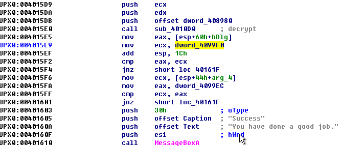

    这里会将两个整数和内存中的两个整数（dword_4099EC和dword_4099F0）比较，相同则算正确

  * 下面接着看下sub_4010D0函数的内容吧

    ```c++
    // decrypt
    int *__cdecl sub_4010D0(int a1, int *a2, int *a3)
    {
      int v3; // eax@1
      int v4; // esi@1
      int v5; // edi@1
      _DWORD *v6; // ebx@1
      int v7; // ebp@2
      bool v8; // zf@2
      int v9; // ecx@3
      int *result; // eax@3
      signed int v11; // [sp+14h] [bp+4h]@1
    
      v3 = *a2;
      v4 = *a3;
      v5 = a1;
      v11 = 16;                                     // 16 rounds of feistel network
      v6 = (_DWORD *)(v5 + 68);
      do
      {
        v7 = *v6 ^ v3;
        v3 = v4 ^ sub_401000(v5, v7);
        --v6;
        v8 = v11 == 1;
        v4 = v7;
        --v11;
      }
      while ( !v8 );
      v9 = v3 ^ *(_DWORD *)(v5 + 4);
      result = a2;
      *a2 = v7 ^ *(_DWORD *)v5;
      *a3 = v9;
      return result;
    }
    ```

    妥妥的，对比维基百科的伪代码，这就是解密过程，传入的a1就是盒子们的地址，这里面调用的sub_401000也就是每层feistel network使用的f函数

    ```c++
    int __cdecl sub_401000(int a1, unsigned int a2)
    {
      return *(_DWORD *)(a1 + 4 * (unsigned __int8)a2 + 3144)
           + (*(_DWORD *)(a1 + 4 * BYTE1(a2) + 2120) ^ (*(_DWORD *)(a1 + 4 * ((a2 >> 16) & 0xFF) + 1096)
                                                      + *(_DWORD *)(a1 + 4 * (a2 >> 24) + 72)));
    }
    ```

    所以我们要寻找一个输入（待解密块），使得解密后的值（块）和内存中的一个块相同

    也就是说我们的输入就是此时加密内存中该块（保存在dword_4099EC和dword_4099F0）的结果

  * 我们先用OD一步步找找，看下主要过程，blowfish函数的盒子是用什么串更新的，还有我们的blowfish的另外几个函数在哪儿（已经找到了f函数，解密函数，还要找加密函数，盒子的更新函数），再结合IDA看下C代码，很容易找到

    ```c++
    // write access to const memory has been detected, the output may be wrong!
    int __stdcall WinMain(HINSTANCE hInstance, HINSTANCE hPrevInstance, LPSTR lpCmdLine, int nShowCmd)
    {
      int v4; // eax@8
      HBRUSH v5; // eax@8
      int v6; // eax@8
      int result; // eax@10
      HKEY phkResult; // [sp+Ch] [bp-18Ch]@1
      DWORD cbData; // [sp+10h] [bp-188h]@2
      CHAR ValueName[4]; // [sp+14h] [bp-184h]@1
      WNDCLASSEXA v11; // [sp+20h] [bp-178h]@8
      struct tagMSG Msg; // [sp+50h] [bp-148h]@8
      CHAR SubKey; // [sp+6Ch] [bp-12Ch]@1
      __int16 v14; // [sp+94h] [bp-104h]@1
      BYTE Data; // [sp+98h] [bp-100h]@2
    
      qmemcpy(&SubKey, "Software\\Microsoft\\Windows\\CurrentVersion", 0x28u);
      strcpy(ValueName, "ProductID");
      v14 = *(_WORD *)"n";
      if ( RegOpenKeyExA(HKEY_LOCAL_MACHINE, &SubKey, 0, 0xF003Fu, &phkResult) )
      {
        lstrcpyA((LPSTR)&Data, "94940361391");
      }
      else
      {
        cbData = 256;
        if ( RegQueryValueExA(phkResult, ValueName, 0, 0, &Data, &cbData) )
        {
          lstrcpyA((LPSTR)&Data, "94940361391");
        }
        else if ( !lstrlenA((LPCSTR)&Data) )
        {
          lstrcpyA((LPSTR)&Data, "94940361391");
        }
        RegCloseKey(phkResult);
      }
      v4 = lstrlenA((LPCSTR)&Data);
      sub_401130((int)dword_408980, (int)&Data, v4);// 第一次更新(初始化)boxes 利用的key是从注册表获取的23位码 获取不了就用串：94940361391
      dword_4099F0 = 2003790946;                    // blow
      dword_4099EC = 1752394086;                    // fish
      sub_401070((int)dword_408980, &dword_4099F0, &dword_4099EC);
      wsprintfA(byte_4099C8, "%08lX%08lX", 0, 0);// 这里后两参数应该是加密后的fishblow 这样也就得到了我们的机器码，放在byte_4099C8中
      v11.cbSize = 48;
      v11.style = 3;
      v11.lpfnWndProc = (WNDPROC)sub_4014B0;
      v11.cbClsExtra = 0;
      v11.cbWndExtra = 0;
      v11.hInstance = hInstance;
      v11.hIcon = LoadIconA(0, (LPCSTR)0x7F00);
      v11.hCursor = LoadCursorA(0, (LPCSTR)0x7F00);
      v5 = (HBRUSH)GetStockObject(0);
      v11.lpszMenuName = 0;
      v11.lpszClassName = "Win32APP";
      v11.hbrBackground = v5;
      v11.hIconSm = 0;
      RegisterClassExA(&v11);
      hWnd = CreateWindowExA(
               0,
               "Win32APP",
               "Win32APP",
               0xCF0000u,
               2147483648,
               2147483648,
               2147483648,
               2147483648,
               0,
               0,
               hInstance,
               0);
      ShowWindow(0, 6);
      UpdateWindow(0);
      v6 = lstrlenA("ChinaCrackingGroup");
      sub_401130((int)dword_408980, (int)"ChinaCrackingGroup", v6);// 第二次更新boxes 使用固定key串：ChinaCrackingGroup
      if ( GetMessageA(&Msg, 0, 0, 0) )
      {
        do
        {
          TranslateMessage(&Msg);
          DispatchMessageA(&Msg);
        }
        while ( GetMessageA(&Msg, 0, 0, 0) );
        result = Msg.wParam;
      }
      else
      {
        result = Msg.wParam;
      }
      return result;
    }
    ```

    我上面已经写了一些注释，自己实际操作很容易也能找到加密函数sub_401070

    ```c++
    // encrypt
    int *__cdecl sub_401070(int a1, int *a2, int *a3)
    {
      int v3; // eax@1
      int v4; // esi@1
      int v5; // edi@1
      _DWORD *v6; // ebx@1
      int v7; // ebp@2
      bool v8; // zf@2
      int v9; // ecx@3
      int *result; // eax@3
      signed int v11; // [sp+14h] [bp+4h]@1
    
      v3 = *a2;
      v4 = *a3;
      v5 = a1;
      v11 = 16;
      v6 = (_DWORD *)v5;
      do
      {
        v7 = *v6 ^ v3;
        v3 = v4 ^ sub_401000(v5, v7);
        ++v6;
        v8 = v11 == 1;
        v4 = v7;
        --v11;
      }
      while ( !v8 );                                // 16-round feistel network
      v9 = v3 ^ *(_DWORD *)(v5 + 64);
      result = a2;
      *a2 = v7 ^ *(_DWORD *)(v5 + 68);
      *a3 = v9;
      return result;
    }
    ```

    和盒子更新函数sub_401130

    ```c++
    // 更新boxes
    signed int __cdecl sub_401130(int a1, int a2, signed int a3)
    {
      int v3; // esi@1
      int *v4; // eax@1
      int *v5; // ecx@1
      signed int v6; // edx@2
      int v7; // edi@3
      signed int v8; // ebp@5
      int v9; // edx@5
      signed int v10; // eax@5
      int v11; // ecx@6
      int v12; // ebx@10
      int v13; // esi@11
      signed int v14; // edi@11
      int v15; // eax@12
      int *v16; // esi@13
      signed int v17; // ebp@13
      signed int v18; // edi@14
      signed int result; // eax@15
      int v20; // ecx@15
      signed int v21; // [sp+10h] [bp-4h]@5
    
      v3 = a1;                                      // P-box start
      v4 = dword_406198;                            // 已知的1024个int
      v5 = (int *)(a1 + 72);                        // P-box end
      do
      {
        v6 = 256;
        do
        {
          v7 = *v4;
          ++v4;
          *v5 = v7;
          ++v5;
          --v6;
        }
        while ( v6 );
      }
      while ( (signed int)v4 < (signed int)"94940361391" );// 初始化S-box[4][256] 直接复制
      v8 = a3;
      v9 = a2;
      v10 = 0;
      v21 = 18;
      do
      {
        v11 = 0;
        a3 = 4;
        do
        {
          v11 = *(_BYTE *)(v10++ + v9) | (v11 << 8);
          if ( v10 >= v8 )
            v10 = 0;
          --a3;
        }
        while ( a3 );                               // 复制a2 每次4个字符 a2的低位放到v11的高位
        v12 = *(int *)((char *)dword_406150 + v3 - a1);
        v3 += 4;
        *(_DWORD *)(v3 - 4) = v11 ^ v12;            // 根据传入字符串a2和0x406150处数组(已知) 更新P-box
        --v21;
      }
      while ( v21 );                                // 初始化P-box[18]
      a3 = 0;                                       // 反复加密更新block [a2][a3] 并利用更新的[a2][a3]更新2个box
      a2 = 0;
      v13 = a1;
      v14 = 9;
      do
      {
        sub_401070(a1, &a3, &a2);                   // 这就是加密的block cipher了 一个block为64bit 用两个int32传入的
                                                    // 18个p-box 4*256=1024个s-box 一次更新两个box
                                                    // 更新它们一共调用521次该函数
        v15 = a2;
        *(_DWORD *)v13 = a3;
        *(_DWORD *)(v13 + 4) = v15;
        v13 += 8;
        --v14;
      }
      while ( v14 );                                // 更新18个P-box 每次更新两个 一共9轮
      v16 = (int *)(a1 + 76);
      v17 = 4;
      do
      {
        v18 = 128;
        do
        {
          sub_401070(a1, &a3, &a2);
          result = a3;
          v20 = a2;
          *(v16 - 1) = a3;
          *v16 = v20;
          v16 += 2;
          --v18;
        }
        while ( v18 );
        --v17;
      }
      while ( v17 );                                // 更新S-box[4][256] 一次更新2个 共4*128轮
      return result;
    }
    ```

    在这个盒子初始化的函数中，我们可以发现前面说的pi的十六进制产生的4096+72 bits的数据，确实是直接被写到了内存中：

    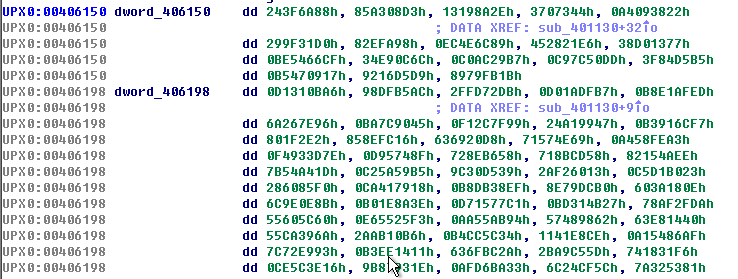

    dword_406150处的72 bits是给P盒初始化用，dword_406198处的4096 bits是给S盒初始化用

  * 了解了blowfish的各个部分后，我们现在其实可以直接找到本机的Unlock Code了

    * 使用OD，在弹出MessageBox前断下后，内存中的盒子以及需要解密成为的块儿都还在，模仿主函数中的调用

      ```asm
      push    offset dword_4099EC
      push    offset dword_4099F0
      push    offset dword_408980
      call    sub_401070      ; encrypt
      ```

    * 同样在OD中，数据窗口中找到4099EC处

      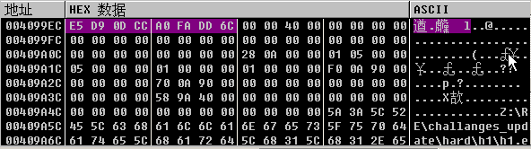

    * 随便找个地方修改汇编，调用加密函数sub_401070

      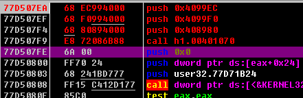

    * 运行后，观察内存地址4099EC处的块儿

      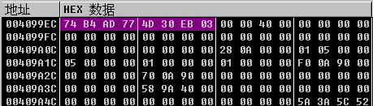

    * 这就找到我们的Unlock Code了，输入试试

      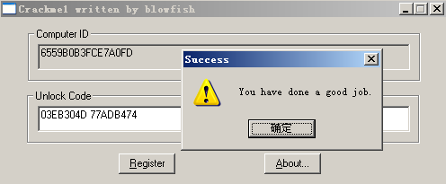

    * 果然没错，不过要自动求出这个值，我们还得具体了解盒子更新过程以及内存中这个块儿的由来

  * 读上面给的IDA的主函数

    * 首先程序从注册表中`Software\Microsoft\Windows\CurrentVersion`下获取ProductID值，获取不了就采用默认值`94940361391`
    * 然后用这个ProductID作为秘钥更新盒子
    * 接着给我们关注的那个块儿（后面我都叫它**目标块**吧）初始化（赋了两个奇怪的整数，但用OD调试时就会发现实际上是初始化为了fishblow这个串 -- 我去，正好64bit，一个块的大小），然后加密这个块儿（调用sub_401070）
    * 在后面似乎是初始化窗口，先跳过，然后又一次更新了盒子，这次采用的秘钥是`"ChinaCrackingGroup"`
    * 就这样吗，只更新了两次盒子，所以我只要后面用`"ChinaCrackingGroup"`来加密目标块用ProductID加密后的值就得到了我们的Unlock Code了
    * 实际测试发现确实不是，为了安全，在OD中给盒子更新函数下断点，这样我们就一定能找到正确的盒子是怎么来的了
    * 后面发现在DialogFunc函数中确实还有一次盒子更新（秘钥`"CrackingForFun"`）以及，加密目标块儿的过程，自己可以试着用OD看看，很简单，下面是程序的主要过程
      1. 注册表中获取ProductID（获取不了就采用默认值`94940361391`）
      2. 用ProductID更新盒子
      3. 目标块初始化为`"fishblow"`
      4. 加密目标块
      5. 用`"ChinaCrackingGroup"`更新盒子
      6. 加密目标块
      7. 用`"CrackingForFun"`更新盒子
      8. 用户输入一个块儿，将用户输入块儿解密
      9. 和目标块比较，相同则成功

### 总结

* 了解Blowfish算法后再做会很轻松，我也是无意搜索到别人的帖子才知道这个原来用的是Blowfish Cipher，然后在维基百科上基本学习了算法，事先了解的应该看到程序标题栏还有目标块初始化为`"fishblow"`心里应该就基本有谱了

* 用IDA查看代码，了解程序逻辑比较方便，具体再结合OD调试验证

* 最后写了一个自动计算Unlock Code的C程序，代码在github，用到的Blowfish加密函数是来自，我稍微改了点儿（其实就把单纯加密块儿的方法改成了共有，原来的是CBC模式，带padding的正常加密变长明文，我只需要里面加密一个块的函数就行了）

  ```c++
  #include <iostream>
  #include <vector>
  #include <cstring>
  #include "blowfish.h"
  
  using namespace std;
  
  void printBlock(unsigned char *plaintext)
  {
      for (int i = 0; i < 8; ++i)
      {
          printf("%02X ", *(plaintext + i));
      }
      printf("\n");
  }
  
  int main(int argc, char const *argv[])
  {
      char k0[30] = "76481-640-8834005-23362";
      // char k0[] = "94940361391";
      printf("Please input your ProductID:\n");
      scanf("%s", k0);
      char k1[] = "ChinaCrackingGroup";
      char k2[] = "CrackingForFun";
      auto cipher = Blowfish(vector<char>(k0, k0 + strlen(k0)));
      unsigned char plaintext[] = "fishblow";
      cipher.EncryptBlock((uint32_t *)(plaintext + 4), (uint32_t *)(plaintext));
  
      printBlock(plaintext);
  
      cipher = Blowfish(vector<char>(k1, k1 + strlen(k1)));
      cipher.EncryptBlock((uint32_t *)(plaintext + 4), (uint32_t *)(plaintext));
  
      printBlock(plaintext);
  
      cipher = Blowfish(vector<char>(k2, k2 + strlen(k2)));
      cipher.EncryptBlock((uint32_t *)(plaintext + 4), (uint32_t *)(plaintext));
  
      printBlock(plaintext);
  
      printf("%#0x %#0x", *(uint32_t *)(plaintext + 4), *(uint32_t *)(plaintext));
      printf("\n");
  
      return 0;
  }
  ```

* 运行效果

  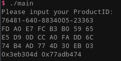

  三行空格分隔的十六进制数就是三次加密目标块的结果，左边是低地址，右边是高地址

  最后一行的两个十六进制数就是我们的Unlock Code，因为在读取我们的输入时用的`sscanf(&String, "%08lX%08lX", &hDlg, &a2);`，所以输入`0x3eb304d 0x77adb474` 或者`3EB304D77ADB474`等等都行，只要这两个整数正常读进去

* 哦，对了，程序显示的Computer ID实际是第一次加密目标块（"blowfish"）时产生的结果，也就是上面输出的第一行啦（倒着看，高位到低位）